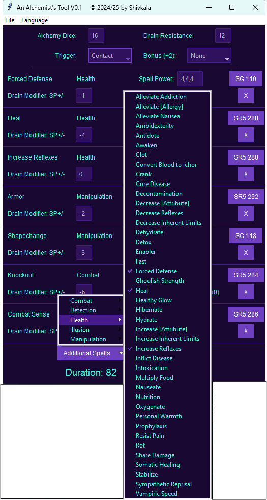

# An-Alchemist-s-Tool-for-Shadowrun-5
### A tool to ease the preparation of  Alchemist spells for Shadowrun 5e Mages and Alchemy Adepts

If you have ever played a Shadowrun character that uses Alchemist spells, you know this can be A LOT of dice rolling
in preparation and a lot of book keeping during the run.

This tool targets to ease the preparation and book keeping in order to focus on the fun part of TTRPGing in the world of SHadowrun

### Setting up the spells
Once you start the tool, some default setup appears with a number of spells (I often use), as seen in the screenshot below:
(No worries, you can change that default later on)

Here you have 
* first the number of your dice you get from your skill + Magic + Foci (if any)
* your drain resistance pool
* the trigger for your spells (Time, Contact, or Command)
* If you have a bonus on a special school of spell (e.g. from a Guardian Spirit) add it here

Then there are the spells:
* In the Spell Power field, you enter the Spell Power of the spell you want to cast. Alchemists often prepare multiples of a
  single spell, so by adding comma seperated numbers, you can cast multiple versions at different spell levels
* Next to the Spell Power you see the book and page number where the spell can be found in the rules.
  As the PDFs of the rule books are obviously not included, the links themselves will not work, but you can easily add the link to your own copy in the code! (Or just take the book in hand and open on the indicated page ;) )

If you want to remove spells, just click on the 'X' of the spell to remove. You can also put the spell levels to 0, this will also prevent the spell to be cast, but it remains in the list for later use.

To add spells, select 'Additional Spells' and select all the spells you want to add from the lisz.
Attention: They will only be put in the active field by clicking on 'Add selected Spell(s)'

### Ready to GO!
Once you are ready to cast all those spells, click 'GO!'

The following will happen:
* All spell dice rolls will be performed, net successes and uncompensated drain will be shown for each spell.
* The overall amount of time to cast the spells will be displayed as Duration in minutes.
* The total of uncompensated drain will be shown
* A new window showing all successful spells with level and number of net successes will pop up

### Available Spells
Each spell cast is listed on the Available Spells window with level, net successes and a checkbox. Spells that had no net success are grayed out.

Once you use your alchemistic spell, just click on the checkbox and it will show that this spell is used up.

